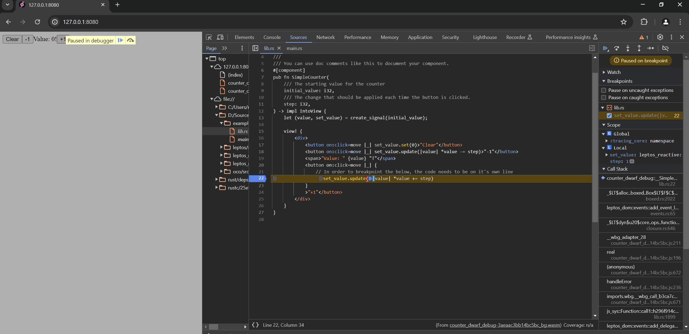

# Leptos Counter Example

This example builds on the simple counter example by adding breakpoints, single stepping the source code and variable inspection.
Both within the browser and VSCode.

This uses a new feature of wasm called Dwarf which is a form of source code mapping.


## How This Works

### Html Changes

First we need to make a change to the index.html file

From this
```html
<link data-trunk rel="rust" data-wasm-opt="z"/>
```

To this
```html
<link data-trunk rel="rust" data-keep-debug="true" data-wasm-opt="z"/>
```

This instructs the rust `trunk` utility to pass a long an option to `wasm-bindgen` called `--keep-debug`  
This option bundles in a type of sourcemap into the built wasm file.  
Be aware that this will make the wasm file much larger however.

### Browser Changes

Next we need to allow the browser to read the DWARF data from the wasm file.
For Chrome / Opera there's an extension here that needs to be installed.

  * https://chromewebstore.google.com/detail/cc++-devtools-support-dwa/pdcpmagijalfljmkmjngeonclgbbannb?pli=1

## Debugging within the Browser

Within the browser's dev console it should now be possible to view the rust source code add breakpoints etc.



## Debugging within VSCode

Note this is still experimental, although I have managed to get breakpoints working under VSCode.
So far I've only tried this within a windows environment.

In order to have the breakpoints land at the correct position within VSCode.  
We need to install the following extension

  * [WebAssembly DWARF Debugging](https://marketplace.visualstudio.com/items?itemName=ms-vscode.wasm-dwarf-debugging)

Within the browser launch section under `launch.json` we need to set userDataDir to false in order for the DWARF browser extension to be loaded.
```json
  {
    "name": "Launch Browser Chrome",
    "request": "launch",
    "type": "chrome",
    "url": "http://localhost:8080",
    "webRoot": "${workspaceFolder}/dist",
    // Needed to keep the dwarf extension in the browser
    "userDataDir": false,
  },
```
